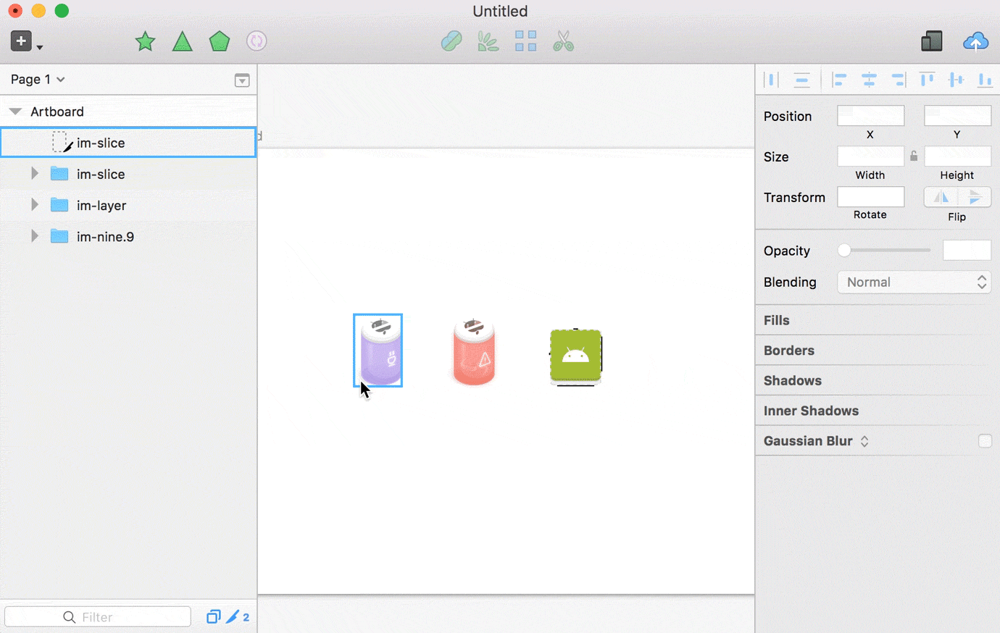

# Slic3r


Your friendly Sketch slicing helper.



Read more at https://ozzik.github.io/Slicer.

## How to install
1. Download and open ```Slic3r-master.zip```
2. Open ```Slic3r.sketchplugin``` (Sketch will magically install the plugin)

## Wha's new
* 1.0.0
  support for web
* 0.0.3
  file names formatted for Android framework don't create unnecessary folders when exporting files

  Export(Android & iOS) of an icon named `09£%-_--Icons/Symbols/Dark/Right` from page `⌘ Icons`
  
```
 |- Android
    |- Icons
        |- drawable-*
            |- n09_icons_symbols_dark_right.png
     
 |- iOS
    |- Icons
       |- n09_icons_symbols_dark_right.png 
```
  The top level has been decided to be left in case you need to distinguish between assets in different pages
  
* 0.0.2
  page name strip of not unicode characters
* 0.0.1
  create a wrapper folder based on the page name, remove error prone exporting options ( not complete ios and Android export )

## Notes
* Tested on Sketch 43.1
